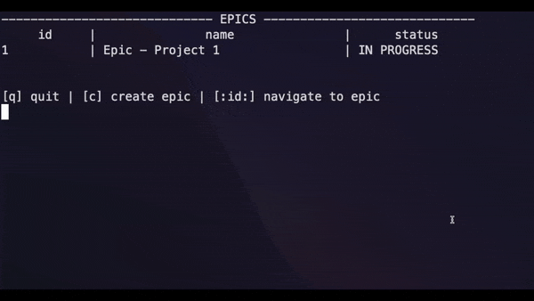

# Jira Clone

## IMPORTANT NOTE

___Please read the project description thoroughly BEFORE getting started, especially the FAQs section.___

___Re-visit the project description multiple times DURING your design and development process, to ensure you're meeting the project requirements.___

## Problem Statement
We will build a Jira clone for the terminal.

We will build two primary features in Jira:
1. Epic CRUD
2. Story CRUD

NOTE: If you're not familiar with Jira, create an [Atlassian account online](https://www.atlassian.com/software/jira) and try it out, or watch a YouTube tutorial.

## Objective
In this project, we aim to learn and practice the following:
* Building CLI apps in Rust
* Reading & writing to disk
* Using third-party crates (like `serde`, `anyhow`, `itertools`, etc.)
* Writing testable code
* Organizing code using modules
* Navigating and contributing to an existing code base

## Terminologies

__Jira, Epic & Story__

Jira is an industry-standard tool for tracking progress of (not limited to) software projects. An Epic is usually used for entire initiatives, while a Story is a smaller unit of work with more specific instructions.

__Model__
Models describe how information is organized, transmitted or stored.

__Database / Storage / Persistence__

Database, storage and persistence are often used interchangeably. They represent the component we use to store and access information for the application.

__CRUD__

CRUD stands for actions of creation, read, update & deletion.
