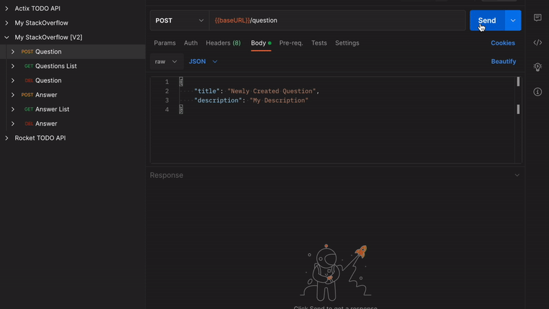

# StackOverflow Clone

## IMPORTANT NOTE

___Please read the project description thoroughly BEFORE getting started, especially the FAQs section.___

___Re-visit the project description multiple times DURING your design and development process, to ensure you're meeting the project requirements.___

## Problem Statement
We will build an API for a StackOverflow-like app.

We will build two primary features in StackOverflow:
1. Question creation, retrieval & deletion
2. Answer creation, retrieval & deletion



## Objective
In this project, we aim to learn and practice the following:
* Designing & building APIs
* Using a backend framework (Rocket)
* Designing SQL models
* Hands-on usage of Postgres
* Writing testable code
* Organizing code using modules
* Navigating and contributing to an existing code base

## Terminologies

__StackOverflow, Question & Answer__

StackOverflow is an industry-standard forum for posting programming related questions and getting crowd-sourced answers. A user posts a question under the user's account, and other users can contribute different answers as they see most appropriate per question. There are additional features on StackOverflow, such as upvoting the question or its corresponding answers. However, question and answer creation, retrieval and deletion are the most primitive.

__API / Endpoint__

API and endpoint are often used interchangeably. They are the backend component that acts as the point of contact for frontend clients. Web APIs use the [HTTP protocol](https://developer.mozilla.org/en-US/docs/Web/HTTP/Overview) to exchange messages with frontend clients. The design of the APIs or endpoints determines how the frontend and backend communicate with one another.

__Model__
Models describe how information is organized, transmitted or stored.

__Database / Storage / Persistence__

Database, storage and persistence are often used interchangeably. They represent the component we use to store and access information for the application.

__CRUD & DAO__

CRUD stands for actions of creation, read, update & deletion. DAO stands for data access object and is an interface in the application to perform these actions against the database.


## Running

__Docker__

1. [Install Docker](https://www.docker.com/)
2. Install the [Postgres image](https://hub.docker.com/_/postgres) by running `docker pull postgres` in your terminal
3. Start a Postgres instance by running:
    ```shell
    $ docker run --name stack-overflow-db -e POSTGRES_PASSWORD=postgrespw -p 55008:5432 -d postgres
    ```

__Migrations__

First, install [sqlx-cli](https://github.com/launchbadge/sqlx/tree/main/sqlx-cli). This is SQLx's associated command-line utility for managing databases, migrations, and more:
```shell
$ cargo install sqlx-cli
```

Now you can execute migrations by running:
```shell
$ sqlx migrate run
```

__NOTE:__ If you ever want to revert the migrations, simply run:
```shell
$ sqlx migrate revert
```

__Persistence__

Now that Postgres is installed and our database tables are setup, let's query our database from `main.rs`!

Do this by completing the TODO items in `main.rs`.

Then run the server using `cargo run` or cargo watch:
```shell
$ cargo watch -q -c -w src/ -x run
```
